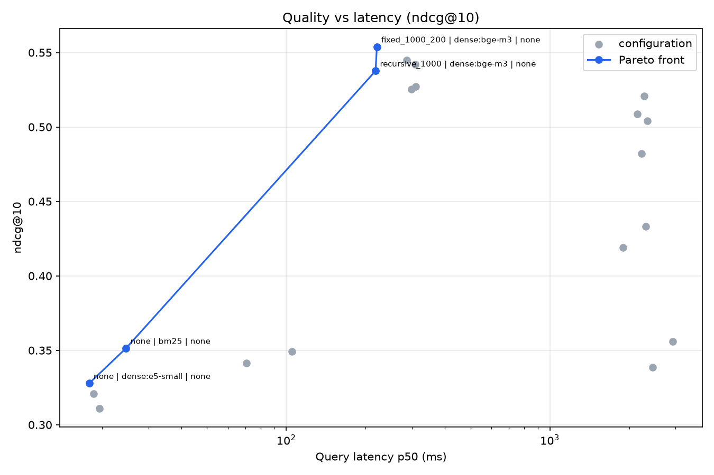

# rag-eval-lab

[](https://github.com/EmericLi/rag-eval-lab/actions/workflows/ci.yml)

**Which retrieval setup should a French-language RAG system use — and what does each
component actually buy you?**

rag-eval-lab benchmarks the retrieval stage of a RAG pipeline: chunking strategies ×
lexical / dense / hybrid retrievers × cross-encoder reranking. It measures quality
(nDCG@10, MRR@10, Recall@5/10) against cost (per-query latency, index time) and reports the
quality/latency Pareto front, so a setup can be chosen on evidence instead of intuition.

Everything runs locally on a laptop CPU — no GPU, no paid API.

## Key results

Benchmark: [AlloprofRetrieval](https://huggingface.co/datasets/lyon-nlp/alloprof) — 2,556
French school-help documents, 300 sampled student questions (seed 42), 20 configurations,
AMD Ryzen 7 8845HS, CPU only.

| Chunking | Retriever | Reranker | nDCG@10 | Recall@10 | Latency p50 |
|---|---|---|---|---|---|
| fixed_1000_200 | dense:bge-m3 | none | **0.554** | 0.709 | 221 ms |
| none | hybrid:bm25+bge-m3 | none | 0.542 | **0.713** | 309 ms |
| fixed_1000_200 | dense:bge-m3 | minilm | 0.504 | 0.695 | 2,348 ms |
| none | bm25 | none | 0.351 | 0.502 | 25 ms |
| none | dense:e5-small | none | 0.328 | 0.455 | 18 ms |



**Three findings**

1. **The embedding model decides, not "lexical vs dense".** bge-m3 beats BM25 by **+58%**
   (0.554 vs 0.351) — but e5-small, also a dense bi-encoder, scores *below* BM25 (0.328).
2. **A reranker weaker than the retriever destroys the ranking.** `mmarco-mMiniLMv2` lifts
   BM25 by +24% (0.349 → 0.433) but costs bge-m3 **−9%** (0.554 → 0.504), for 11× the latency.
   Every reranked configuration is off the Pareto front.
3. **Hybrid search pays only when both sides are comparable.** With bge-m3, RRF matches the
   dense retriever alone (0.542 vs 0.545) — but that flat number hides real churn: fusion
   recovers 16 queries that only BM25 solved while forfeiting 21 that only dense solved,
   leaving 6 points of hit@10 between RRF and the oracle union.

Full analysis, failure cases and limitations: [docs/results-v1.md](docs/results-v1.md).

## Quickstart

```bash
uv sync --extra models
uv run rel run configs/v1.yaml     # runs the grid (resumable)
uv run rel report results/v1       # writes report.md + charts
```

The first run downloads the dataset and the models (~3 GB) into the Hugging Face cache.
Embeddings are cached on disk, so re-running a grid only recomputes what changed.

## How it works

```
configs/*.yaml ──> experiment runner ──> results/<run>/results.jsonl ──> report
                        │
     dataset ──> chunker ──> retriever ──> reranker (optional) ──> doc ids
```

| Module | Role |
|---|---|
| `data.py` | Loads AlloprofRetrieval or a local JSONL corpus; deterministic sampling |
| `chunking.py` | `none`, fixed-size with overlap, recursive (paragraph → line → sentence → word) |
| `retrieval.py` | BM25, dense (bi-encoder), hybrid via Reciprocal Rank Fusion |
| `reranking.py` | Cross-encoder reranking of the top candidates |
| `pipeline.py` | Wires the stages and maps chunk hits back to documents (max-score per document) |
| `experiment.py` | Expands the grid, times each run, records results, resumes where it stopped |
| `report.py` | Ranking table, Pareto front, charts |
| `cli.py` | `rel run` / `rel report` |

Each stage is a small interchangeable component, so a grid of configurations is just a YAML
file. A configuration that fails is recorded as an error and does not abort the grid, and
every result carries the metrics, latency percentiles, index time, library versions and git
commit that produced it.

## Configuration

```yaml
dataset: { name: alloprof, n_queries: 300, seed: 42 }
k: 10
ks: [5, 10]
candidates: 30            # chunks passed to the reranker
grid:
  chunker:   [none, fixed_1000_200, recursive_1000]   # sizes in characters
  retriever: [bm25, dense:e5-small, dense:bge-m3, hybrid:bm25+bge-m3]
  reranker:  [none, minilm]
exclude:
  - { chunker: none, reranker: minilm }
```

Available specs:

- **chunker**: `none`, `fixed_<size>_<overlap>`, `recursive_<size>` (characters)
- **retriever**: `bm25`, `dense:<encoder>`, `hybrid:<a>+<b>`
- **encoder**: `e5-small`, `e5-base`, `bge-m3`, `hashing` (model-free baseline)
- **reranker**: `none`, `minilm`, `bge-v2-m3`

Any corpus can be benchmarked by pointing the config at a JSONL dataset
(`{"id", "text"}` documents and `{"id", "text", "relevant": [...]}` queries).

## Development

```bash
uv sync
uv run pytest      # 68 tests, no network, no model download
uv run ruff check .
```

Tests use a model-free hashing encoder and injected fake models, so CI stays fast and
offline.

## Roadmap

- **v2** — answer generation: faithfulness and answer-relevance scored by an LLM judge
  (local Ollama model vs a free-tier API), with the judge calibrated against human labels;
  synthetic question generation for any corpus.
- **v3** — a small demo app (Streamlit or FastAPI) on top of the best configuration.

## License

Not licensed yet — all rights reserved for now. Dataset: AlloprofRetrieval
(`lyon-nlp/alloprof`, Apache-2.0).
