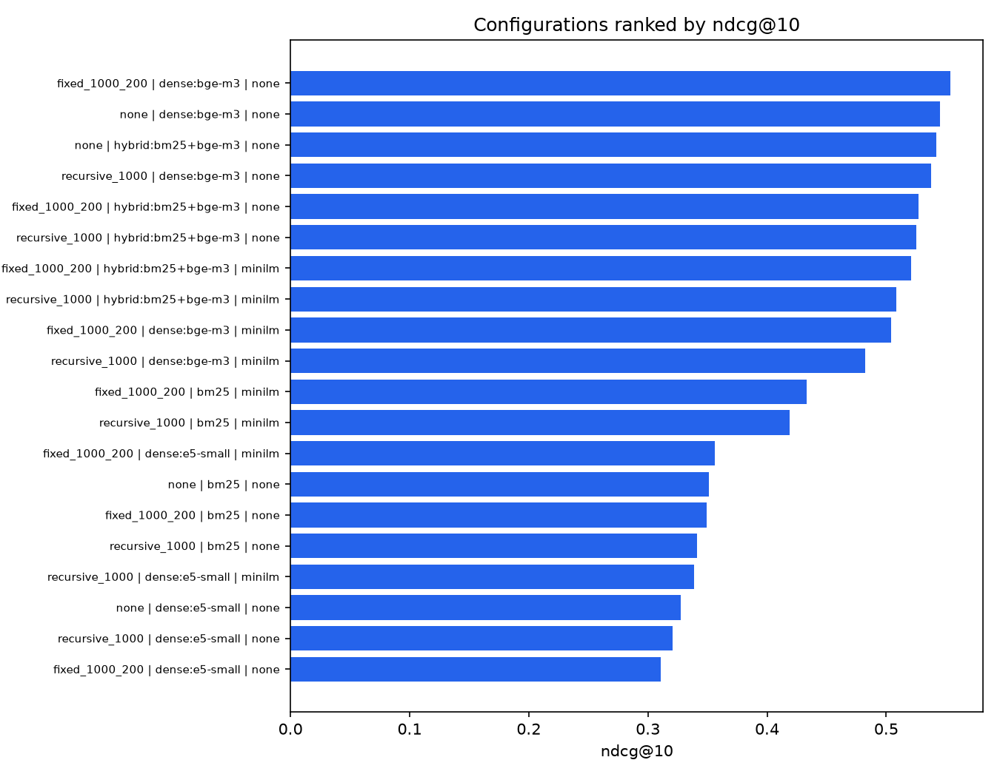

# Retrieval benchmark report

- Configurations: 20
- Queries: 300
- Primary metric: `ndcg@10`

| Rank | Chunker | Retriever | Reranker | mrr@5 | mrr@10 | ndcg@5 | ndcg@10 | recall@5 | recall@10 | p50 (ms) | p95 (ms) | Index (s) | Chunks | Pareto |
|---|---|---|---|---|---|---|---|---|---|---|---|---|---|---|
| 1 | fixed_1000_200 | dense:bge-m3 | none | 0.512 | 0.522 | 0.529 | 0.554 | 0.635 | 0.709 | 220.7 | 336.1 | 77157.3 | 12022 | ★ |
| 2 | none | dense:bge-m3 | none | 0.504 | 0.516 | 0.519 | 0.545 | 0.616 | 0.693 | 286.0 | 446.1 | 1996.3 | 2556 |  |
| 3 | none | hybrid:bm25+bge-m3 | none | 0.497 | 0.509 | 0.506 | 0.542 | 0.608 | 0.713 | 308.8 | 509.8 | 0.8 | 2556 |  |
| 4 | recursive_1000 | dense:bge-m3 | none | 0.497 | 0.508 | 0.513 | 0.538 | 0.618 | 0.688 | 218.3 | 333.1 | 6904.0 | 11022 | ★ |
| 5 | fixed_1000_200 | hybrid:bm25+bge-m3 | none | 0.477 | 0.490 | 0.494 | 0.527 | 0.609 | 0.702 | 309.3 | 678.5 | 0.8 | 12022 |  |
| 6 | recursive_1000 | hybrid:bm25+bge-m3 | none | 0.482 | 0.495 | 0.490 | 0.525 | 0.590 | 0.694 | 298.3 | 640.3 | 0.8 | 11022 |  |
| 7 | fixed_1000_200 | hybrid:bm25+bge-m3 | minilm | 0.463 | 0.479 | 0.480 | 0.521 | 0.592 | 0.710 | 2275.7 | 3028.6 | 5.4 | 12022 |  |
| 8 | recursive_1000 | hybrid:bm25+bge-m3 | minilm | 0.440 | 0.460 | 0.461 | 0.509 | 0.580 | 0.720 | 2146.2 | 2886.0 | 5.3 | 11022 |  |
| 9 | fixed_1000_200 | dense:bge-m3 | minilm | 0.447 | 0.461 | 0.464 | 0.504 | 0.574 | 0.695 | 2348.1 | 2777.7 | 5.3 | 12022 |  |
| 10 | recursive_1000 | dense:bge-m3 | minilm | 0.425 | 0.440 | 0.446 | 0.482 | 0.566 | 0.674 | 2225.7 | 2691.8 | 4.8 | 11022 |  |
| 11 | fixed_1000_200 | bm25 | minilm | 0.406 | 0.417 | 0.408 | 0.433 | 0.478 | 0.551 | 2310.0 | 3243.4 | 8.3 | 12022 |  |
| 12 | recursive_1000 | bm25 | minilm | 0.386 | 0.399 | 0.390 | 0.419 | 0.467 | 0.549 | 1895.9 | 2720.4 | 5.9 | 11022 |  |
| 13 | fixed_1000_200 | dense:e5-small | minilm | 0.316 | 0.325 | 0.333 | 0.356 | 0.414 | 0.483 | 2930.8 | 3066.7 | 4.6 | 12022 |  |
| 14 | none | bm25 | none | 0.310 | 0.323 | 0.320 | 0.351 | 0.410 | 0.502 | 24.7 | 97.5 | 0.9 | 2556 | ★ |
| 15 | fixed_1000_200 | bm25 | none | 0.310 | 0.320 | 0.324 | 0.349 | 0.421 | 0.493 | 104.9 | 378.6 | 0.9 | 12022 |  |
| 16 | recursive_1000 | bm25 | none | 0.301 | 0.312 | 0.313 | 0.342 | 0.406 | 0.487 | 70.6 | 261.5 | 0.7 | 11022 |  |
| 17 | recursive_1000 | dense:e5-small | minilm | 0.305 | 0.314 | 0.316 | 0.338 | 0.390 | 0.455 | 2458.6 | 2672.8 | 4.9 | 11022 |  |
| 18 | none | dense:e5-small | none | 0.294 | 0.303 | 0.305 | 0.328 | 0.389 | 0.455 | 17.9 | 32.6 | 0.0 | 2556 | ★ |
| 19 | recursive_1000 | dense:e5-small | none | 0.281 | 0.292 | 0.293 | 0.321 | 0.372 | 0.456 | 18.6 | 32.4 | 0.3 | 11022 |  |
| 20 | fixed_1000_200 | dense:e5-small | none | 0.264 | 0.276 | 0.280 | 0.311 | 0.362 | 0.454 | 19.6 | 34.7 | 935.4 | 12022 |  |

## Notes

- Latency is measured per query on CPU, including query encoding and reranking.
- Index time includes embedding computation only when the embedding cache was cold.
- ★ marks configurations on the quality/latency Pareto front.
